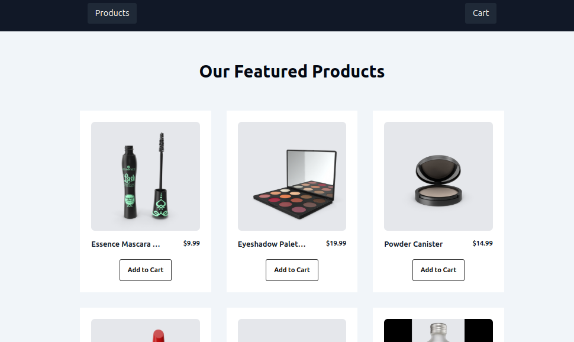
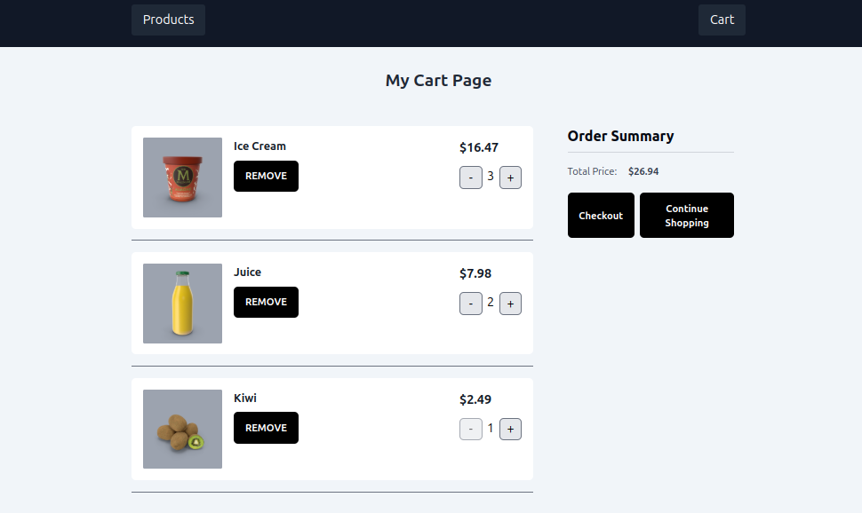

# Online Shop

This is an online shop built using React and React Router. It allows users to browse and purchase products.

## Features

- **Product Listing**: Users can view a list of products with their images, names, prices, and descriptions.
- **Product Details**: Users can view detailed information about a product.
- **Shopping Cart**: Users can add products to their shopping cart and update the quantity of items.
- **Responsive Design**: The online shop is designed to be responsive and work well on different devices.

## Technologies Used

- **React**: The front-end of the online shop is built using React.
- **React Router**: React Router is used for routing and handling navigation within the app.
- **Vite**: Vite is used as the build tool for the project.
- **ESLint**: ESLint is used for code linting and maintaining code quality.
- **Tailwind CSS**: Tailwind CSS is used for styling the app.

## Data Source

This online shop uses the [DummyJSON API](https://dummyjson.com) to fetch product data. The DummyJSON API is a free and public API that provides a simple way to retrieve product information.

## Installation

1. Clone the repository: `git clone <repository-url>`
2. Install dependencies: `npm install`
3. Start the development server: `npm run dev`
4. Open the app in your browser: `http://localhost:3000`

## Usage

1. Browse the product listing page to view available products.
2. Click on a product to view its details.
3. Add products to the shopping cart by clicking the "Add to Cart" button.
4. Update the quantity of items in the shopping cart.

## Screenshots

### Home Page

### Cart Page

