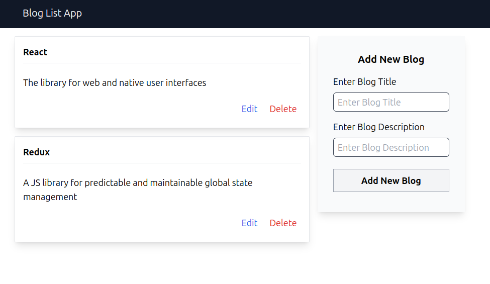

# Blog List App

This is a Blog List application built with `React` and `Redux`. The app allows users to add, edit, and delete blog posts, with the state being managed by Redux. It also uses local storage to persist data across sessions.

## Functionality

- Add a new blog post by entering a title and description.
- Edit an existing blog post.
- Delete a blog post with a confirmation modal.
- State is maintained with Redux and persists through local storage.

## Acknowledgements

This project uses the following libraries:

- **React**: A JavaScript library for building user interfaces.
- **Redux**: A predictable state container for JavaScript apps.
- **@reduxjs/toolkit**: The official, recommended way to write Redux logic.
- **Tailwind CSS**: A utility-first CSS framework for styling the components.

## Project Structure

```
main.jsx
App.jsx
blog-app/
│   ├── BlogList.jsx
│   └── AddNewBlog.jsx
store/
│   ├── index.js
│   └── slices/
│       └── blogSlice.js
```

## File Descriptions

- **`blog-app/BlogList.jsx`**: This component displays a list of blogs. It allows users to edit or delete existing blogs. It uses global state management with Redux to retrieve and modify the list of blogs.

- **`blog-app/AddNewBlog.jsx`**: A form component that allows users to add a new blog or edit an existing one. The input fields are managed with Redux state, and submissions are handled accordingly.

- **`store/index.js`**: This file sets up the Redux store using `@reduxjs/toolkit`'s `configureStore`. It includes the `blog` reducer for state management.

- **`store/slices/blogSlice.js`**: This file contains the reducer and actions for managing blog-related state. It uses `createSlice` from `@reduxjs/toolkit` to simplify the creation of actions and reducers.

## Getting Started

### Prerequisites

- `Node.js` and `npm` installed on your machine.

### Installation

1. Clone the repository.

   ```bash
   git clone <repository-url>
   ```

2. Navigate to the project directory.

   ```bash
   cd <project-directory>
   ```

3. Install the dependencies.

   ```bash
   npm install
   ```

### Running the App

Start the development server.

```bash
npm run dev
```

The application should open in your default web browser at `http://localhost:3000`.

### Screenshot


